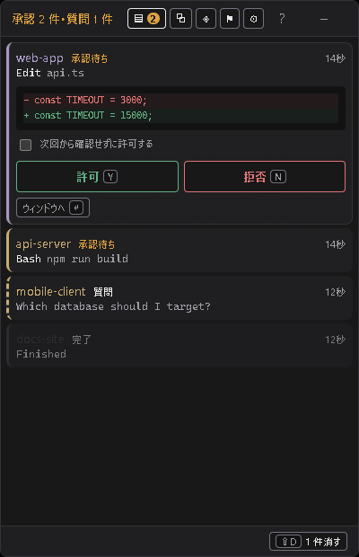

# Signalpost

並列で動かしている Claude Code の**承認待ちを 1 か所に集めて、そこで処理する**ための常駐アプリ。

複数の VS Code ウィンドウを目視で巡回する必要をなくすのが目的なので、「通知して切り替えさせる」のではなく
**切り替えずに承認を返す**ところまでやる。

**1 画面のときにこそ効く。** 見えないセッションは結局こまめに確認することになり、ノート PC の画面が
エージェントの表示で埋まる。このツールを置けばセッションを裏に回してよくなる。パネルは常に最前面、
タスクバーには出ず、**キーボードを奪わない**ので、画面いっぱいで別の作業をしながら隅に置いておける。



承認待ちが上、古い順。`Y` で許可、`N` で拒否すればセッションが動き出す。
エディタのウィンドウは開かない。

バーに畳むこともできる。出しっぱなしにしておける大きさで、一番待たせている
セッションの名前と経過時間を出す:


ホバーで覗き、クリックで開く。

## 仕組み

Claude Code の `PermissionRequest` hook は HTTP タイプに対応していて、レスポンスで判断を返すと
それがそのまま採用される。しかも hook のタイムアウトは 600 秒ある。

Signalpost はこの**レスポンスを返さずに握ったまま**にして、パネル上でキーが押された瞬間に返す。

```
Claude Code ──POST /hook/permission──▶ Signalpost (レスポンス保留)
                                              │
                                        パネルに 1 行追加
                                              │
                                     ユーザーが Y を押す
                                              ▼
Claude Code ◀──── 判断を返す ───────────── レスポンス解放 → セッション再開
```

返す JSON の形はこれでなければならない。

```json
{ "hookSpecificOutput": {
    "hookEventName": "PermissionRequest",
    "decision": { "behavior": "allow" } } }
```

`decision` は**文字列ではなくオブジェクト**で、拒否理由のキーは `reason` ではなく `message`。
公開ドキュメントは `"decision": "allow"` という文字列の例を載せているが、実装
(`claude.exe` 内の `e.hookSpecificOutput.decision.behavior === "allow"`) はそれを読まない。
形が違うと**エラーにならず黙って無視される**ので、パネルで押しても何も起きない状態になる。

安全側に倒してあり、アプリを落とす / 570 秒以内に触らない場合は**判断なし**を返すので、
承認は普段どおりエディタ側に出る。ロックされることはない。

## 使い方

1. アプリを起動する（トレイに常駐する）
2. 初回は「設定」画面が開くので **hooks を設定する** を押す
   → `~/.claude/settings.json` にマージされる（`.bak` を残す。既存設定は保持）
3. 動作中の Claude Code を再起動する

以降、承認待ちが出るとパネルが右端に出てくる。**キーボードを奪わない**ので、
入力中でも作業は中断されない。処理したくなったら `Alt+Space`。

### キー操作

| キー | 動作 |
| --- | --- |
| `Alt+Space` | パネルを出す / 隠す（グローバル） |
| `J` / `K` | 行を移動 |
| `Y` | 許可 |
| `N` | 拒否 |
| `Enter` | そのセッションのウィンドウを前面に出す |
| `D` | 情報行を消す |
| `Shift+D` | 完了行をまとめて消す |
| `W` / `P` / `R` / `S` | セッション / 色・名前 / ルール一覧 / 設定 |
| `M` | 30分ポップアップしない |
| `C` | バーに畳む |
| `Esc` | 受信箱では隠す。他の画面では受信箱に戻る |
| `?` | このキー一覧をアプリ内で表示 |

ルールを作るキーは無い。一度だけ許可するのと恒久的に許可するのとが
1 キーの差であってはならないため、行のチェックボックスからのみ作れる。

ヘッダのナビ（受信箱 / ルール / 設定）はどの画面からでも押せる。

### 位置

初期状態では出ているモニタの右端にドッキングする。ヘッダをドラッグすれば好きな場所に移動でき、
端をつまめばリサイズできる。**一度自分で動かすと以降はその位置と大きさを覚えて**そこに出る
（`window.json` に保存）。

### 並び順

承認待ちが上、その中で**待たせている順**。放置されている 1 件が下に埋もれないようにするため。

### 色と名前

プロジェクト（cwd）ごとに色が付く。設定しなくてもパスから決定的に決まるので、
最初から色分けされている。`P` で開く「色/名前」から改名と色変更ができ、変更は
`projects.json` に保存されてセッションをまたいで残る。

セッション ID ではなく cwd に紐づけているのは、それが再起動しても変わらず、
VS Code のウィンドウと 1 対 1 で対応するため。

### 反応

| 設定 | 内容 | 既定 |
| --- | --- | --- |
| 通知音 | 行の種類ごとに違う音（承認待ち＝上昇、質問＝下降、完了＝アルペジオ） | オン |
| 新着・完了でフラッシュ | 新着で枠が黄色、最後の 1 件を片付けると緑に光る | オン |
| 空になったら隠す | 0 件でパネルを畳む | オフ |
| 背景の不透明度 | 40〜100%。文字と枠は不透明のまま | 100% |

既定で「空になったら隠す」がオフなのは、勝手に消えて再び現れる動きがちらつきとして
目に付くため。代わりにフラッシュが片付いたことを知らせる。

## Codex CLI

Codex のセッションも同じ受信箱に並ぶ（`codex` タグ付き）。ただし**情報表示のみ**。
Codex はターン完了でしか `notify` を発火せず、承認を返せる hook もないので、答えるものがない。

Codex の `notify` は 1 つしか設定できないため、単純に奪うことはできない。
小さなシムを前に挟み、既存のものを後ろに連結する:

```toml
notify = ["…\\signalpost-codex.exe", "--chain", "…\\元のプログラム.exe", "その引数"]
```

シムはイベント JSON をパネルに POST してから、元のプログラムを**本来渡されるはずの引数のまま**実行する。
設定を削除すると元に戻る。どちらも「設定」タブから。

## 設定される hooks

| イベント | エンドポイント | 用途 |
| --- | --- | --- |
| `PermissionRequest` | `/hook/permission` | 承認待ちを保留してパネルに出す（timeout 600s） |
| `Notification` | `/hook/notification` | 質問待ち・完了を表示 |
| `PostToolUse` | `/hook/tool-settled` | エディタ側で決着した行を retire |
| `PermissionDenied` | `/hook/tool-settled` | 自動モードの拒否のみ。ほぼ発火しない |
| `Stop` | `/hook/turn-end` | ターン終了時に残っている保留を掃除 |
| `SessionEnd` | `/hook/session-end` | 終了したセッションの行を掃除 |

エディタ側で承認した場合、行が消えるのは**そのコマンドが終わってから**になる。
承認の瞬間を知らせるフックが存在しないため。詳細は [docs/DESIGN.md](docs/DESIGN.md)。

matcher は付けず、種類の振り分けはアプリ側でやっている。将来 Claude Code に通知種別が
増えても取りこぼさないため。

サーバは `127.0.0.1` のみにバインドする。ポートは既定 `8787`、環境変数 `SIGNALPOST_PORT` で変更可能
（変更したら「設定」から hooks を入れ直す）。

## 自動許可ルール

承認する前に「次回から確認せずに許可する」にチェックを入れると、ルールが
`%APPDATA%/Signalpost/auto-allow.json` に保存され、一致する呼び出しは
**パネルに出ないまま即座に許可される**。使うほど待ちの件数が減っていく。
一覧・発火回数・削除は `R`。

スコープは 3 つ。狭い順に:

| スコープ | 対象 |
| --- | --- |
| この呼び出しだけ | コマンド文字列が完全一致するもの |
| **先頭が一致するコマンド** | 編集できる前方一致。単語の境界で切れる |
| ツール全体 | 中身を問わずそのツールの全呼び出し |

既定は前方一致で、通常はこれを使う。シェルコマンドが 2 回続けて完全一致することは
まず無いので、完全一致で作ったルールは二度と発火しない。
ルールはプロジェクトのディレクトリ**とその配下**に効く。`frontend/` で起動した
セッションはルートではなくそのディレクトリを報告してくるため。

危険と判定された呼び出しは、そもそもルールにできない。

## 開発

```sh
npm install
npm run tauri dev      # 開発
npm run tauri build    # NSIS インストーラを生成
cargo test --manifest-path src-tauri/Cargo.toml
```

設計上の判断と、調べて分かった事実（どこにも記載のないフックの挙動を含む）は
**[docs/DESIGN.md](docs/DESIGN.md)** にまとめてある。承認まわりを触る前に読むこと。

`GET /queue` で受信箱の中身と各行の待ち時間が読める。行がちゃんと消えたかの確認用。

- フロントエンド: React 19 + TypeScript + Vite
- バックエンド: Rust / Tauri 2 / axum

## 制限

- VS Code は 1 ウィンドウに複数セッションのタブを開ける。その場合 `cwd` が同じなので
  `Enter` はウィンドウの前面化までで、タブの特定まではできない。
- `code` コマンドに PATH が通っている必要がある（VS Code の
  「Shell コマンド: PATH 内に 'code' コマンドをインストールします」）。
