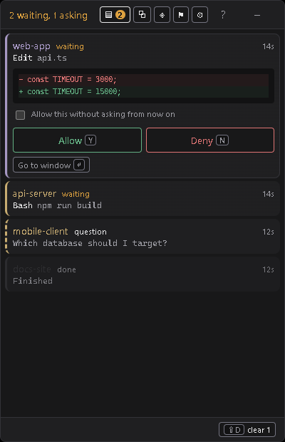
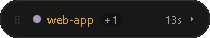

# Signalpost

[](https://github.com/Taka-S-dev/signalpost/actions/workflows/ci.yml)

*[日本語版はこちら](README.ja.md)*

A tray app that collects the approval prompts from every Claude Code session
you are running **and lets you answer them in one place**.

The point is not to notify you so you go and find the right window — it is to
make finding the window unnecessary. Approvals are answered from the panel, so
the sessions never need to be visited at all.

That matters most on one screen. A session you cannot see is a session you
have to keep checking, so a laptop ends up showing the agent instead of the
work. Here the sessions can be buried under whatever you are actually doing:
the panel stays on top of them, keeps out of the taskbar, and never takes
keyboard focus, so it can sit in a corner while you use the whole screen for
something else.



Blocked calls sit at the top, oldest first. `Y` allows, `N` denies, and the
session carries on — the editor window is never opened.

It also collapses to a bar, small enough to leave on screen all day. It names
the session that has waited longest and how long it has been:



Point at it to peek, click to open.

## How it works

Claude Code's `PermissionRequest` hook can be an HTTP hook, and whatever it
returns becomes the verdict. A hook is allowed 600 seconds.

Signalpost **holds that response open** and only answers when you press a key.

```
Claude Code ──POST /hook/permission──▶ Signalpost (response parked)
                                              │
                                       a row appears
                                              │
                                     you press Y
                                              ▼
Claude Code ◀──── verdict ────────────── response released → session resumes
```

The response has to be shaped exactly like this:

```json
{ "hookSpecificOutput": {
    "hookEventName": "PermissionRequest",
    "decision": { "behavior": "allow" } } }
```

`decision` is an **object with a `behavior` field**, not a string, and the
denial text is `message`, not `reason`. The published docs show
`"decision": "allow"`, but the implementation
(`e.hookSpecificOutput.decision.behavior === "allow"` inside `claude.exe`)
does not read that. A wrong shape **fails silently**, which looks exactly like
the app being ignored.

It fails safe: if the app is closed, or nothing is pressed within 570 seconds,
it returns **no decision** and the prompt appears in the editor as usual.
Nothing can end up stuck.

## Getting started

1. Run the app — it lives in the tray.
2. The **Settings** screen opens on first run. Press **Install hooks**.
   They are merged into `~/.claude/settings.json`, keeping your existing
   settings and writing a `.bak` first.
3. Restart any running Claude Code session.

From then on the panel appears when something needs approving. It **does not
take keyboard focus**, so it never interrupts what you are typing. Press
`Alt+Space` when you are ready to deal with it.

### Keys

| Key | Action |
| --- | --- |
| `Alt+Space` | Show / hide the panel (global) |
| `J` / `K` | Move between rows |
| `Y` | Allow |
| `N` | Deny |
| `Enter` | Bring that session's window to the front |
| `D` | Dismiss an informational row |
| `Shift+D` | Clear the finished rows |
| `W` / `P` / `R` / `S` | Windows / colors / rules / settings |
| `M` | Stop popping up for 30 minutes |
| `C` | Collapse to the bar |
| `Esc` | Hide the panel; from any other view, go back to the inbox |
| `?` | Show this list in the app |

No key creates a standing rule. Making a call permanent should not be one
keystroke away from answering it once — tick the checkbox on the row instead.

### Ordering

Blocked calls first, oldest at the top. Nothing can sit forgotten at the
bottom of the list.

### Projects

Each project (`cwd`) gets a colour, derived from the path so it is there
without any configuration. Rename it or pick a different colour under `P`;
both persist in `projects.json`.

Identity is keyed on the folder rather than the session id, because that is
what survives a restart and what maps one-to-one to an editor window.

`Enter` runs `code -r "{cwd}"` by default. Sessions run from a terminal can
use something else — `wt -d "{cwd}"`, for instance — set per project.

### Highlighting risky calls

Rules match a case-insensitive substring of the command and give the row an
icon, a label and a colour. Danger outranks caution; within a level the longer
match wins, so `git push --force` reads as a force push rather than a push.

Fifteen rules ship enabled by default (force push, `reset --hard`, `rm -rf`,
`DROP TABLE`, `npm publish`, `terraform apply`, …). Edit them under `R`.

### Feedback

| Setting | What it does | Default |
| --- | --- | --- |
| Sound | A different cue per row type | on |
| Flash | Amber on arrival, green when the last row clears | on |
| Hide when empty | Collapse the panel at zero rows | off |
| Background opacity | 40–100%. Text and borders stay opaque | 100% |

"Hide when empty" is off by default because a window that disappears and
reappears on its own reads as flicker. The flash acknowledges the clear
instead.

### Language

English and Japanese, following the OS by default. Change it under `S`.

## Codex CLI

Codex sessions show up in the same list, tagged `codex`. They are
informational only: Codex fires `notify` on turn completion and has no hook
that can return an approval, so there is nothing to answer.

Codex allows exactly one `notify` program, so installing cannot simply take
the slot. A small shim goes in front and chains whatever was already there:

```toml
notify = ["…\\signalpost-codex.exe", "--token", "…", "--chain", "…\\your-program.exe", "its-arg"]
```

The shim posts the event JSON to the panel and then runs the original program
with the arguments it would have received. Removing the wiring puts the
original back. Both are done from **Settings**.

## Hooks it installs

| Event | Endpoint | Purpose |
| --- | --- | --- |
| `PermissionRequest` | `/hook/permission` | Parks the call and shows the row (timeout 600s) |
| `Notification` | `/hook/notification` | Questions and finished turns |
| `PostToolUse` | `/hook/tool-settled` | Retires a row settled in the editor |
| `PermissionDenied` | `/hook/tool-settled` | Auto-mode denials only; rarely fires |
| `Stop` | `/hook/turn-end` | Clears anything still parked when the turn ends |
| `SessionEnd` | `/hook/session-end` | Cleans up a finished session's rows |

No matchers are used; the app filters by type itself, so a notification type
added later cannot silently stop arriving.

Approve in the editor rather than the panel and the row clears only once the
command **finishes running** — no hook reports the moment a permission is
granted. See [docs/DESIGN.md](docs/DESIGN.md) for what was measured.

The server binds `127.0.0.1` only. The port defaults to `8787` and can be
changed with `SIGNALPOST_PORT` — reinstall the hooks afterwards.

### What the endpoints are protected by

Every hook URL carries a secret generated on first run and kept in
`hook-token` beside the other config, so the installed hooks look like
`/hook/<token>/permission`. Anything else gets a 404.

| | |
| --- | --- |
| Another machine | Cannot reach it: the socket is bound to loopback |
| A web page you visit | Cannot post: the endpoints require `application/json`, so a browser must preflight, and no CORS headers are returned |
| Another account on this PC | Usually cannot post: loopback is shared, but the token sits in your profile — see the caveat below |
| Code running as **you** | **Can** post — it can read the token, as it can read anything else of yours |

The last row is the honest limit. A forged request cannot make Claude Code run
anything: answering it only answers that request. What it could do is put a
convincing row in the panel, which is why the token exists at all.

The third row depends on your profile's permissions, which are not always what
Windows set up. Checking the file on the machine this was written on found a
group with read access that some other tool had added, and an administrator
can read it regardless. If that matters to you, check with
`icacls "%APPDATA%\Signalpost\hook-token"` rather than assuming.

A dangerous call cannot become an auto-allow rule. The checkbox is disabled in
the UI *and* the backend refuses, so the invariant does not rest on the
screen being the only way in.

## Auto-allow rules

Tick **allow without asking** before answering and a rule is stored in
`auto-allow.json`; matching calls are then **allowed immediately without ever
reaching the panel**. The queue gets quieter the more you use it. List, count
and remove them under `R`.

Three scopes, narrowest first:

| Scope | Matches |
| --- | --- |
| this exact call | the command byte for byte |
| **commands starting with…** | an editable prefix, ending on a word boundary |
| every call of this tool | any call of it, contents unseen |

The prefix scope is the default and usually the one you want: shell commands
are never byte-identical twice, so an exact-call rule made on one will not fire
again. Rules cover the project directory **and everything below it**, since a
session started in `frontend/` reports that directory rather than the root.

Calls the risk rules mark dangerous cannot be turned into a rule at all.

## Development

```sh
npm install
npm run tauri dev      # develop
npm run tauri build    # produce an NSIS installer
cargo test --manifest-path src-tauri/Cargo.toml
```

CI runs the same six checks on Windows — typecheck, `npm test`, frontend
build, `cargo fmt --check`, `clippy -D warnings`, `cargo test` — so anything
green here is green there. Windows only, because a pass from a platform the
app cannot run on would say nothing.

- Frontend: React 19 + TypeScript + Vite
- Backend: Rust / Tauri 2 / axum

Config lives in `%APPDATA%/Signalpost`: `auto-allow.json`, `projects.json`,
`risk.json`, `settings.json`, `window.json`.

`GET /queue` reports what the inbox is holding and how long each row has
waited — useful for checking whether a row was retired when it should have
been.

**[docs/DESIGN.md](docs/DESIGN.md)** records why the app is built this way and
what had to be measured to find out, including the hook behaviour that is not
documented anywhere. Read it before changing the approval path.

## Limitations

- Windows only. The approval path itself is portable, but the window list and
  the default jump command are Win32 / VS Code specific.
- VS Code can host several sessions in one window. They share a `cwd`, so
  `Enter` can focus the window but not the tab.
- `code` must be on `PATH` (VS Code's "Shell Command: Install 'code' command
  in PATH").
